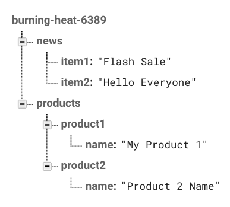
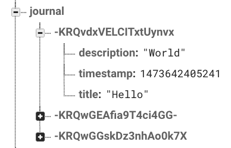

# Firebase Database

Firebase offers a very flexible and secure way to save text-based data.

This guide will show some of the most common scenarios and it will explain how to use Rules for your database. It is also written from a SQL perspective.

## iOS NSAppTransportSecurity

Before you start integrating Firebase Database in your iOS projects you must add the following exceptions in the `info.plist` file.

```xml
<key>NSAppTransportSecurity</key>
    <dict>
        <key>NSExceptionDomains</key>
        <dict>
            <key>firebaseio.com</key>
            <dict>
                <key>NSIncludesSubdomains</key>
                <true/>
                <key>NSThirdPartyExceptionRequiresForwardSecrecy</key>
                <false/>
            </dict>
        </dict>
    </dict>
```

Firebase Auth and Storage don't rely on these rules to function.

## Understanding the Data

The data saved in the Firebase database is structured like a tree. Each 'branch' can have its own branches and those sub branches can have their own sub branches.



The Firebase data can only be retrieved as JSON, you will require to use the JSON class to convert the data into an ActionScript Object.

## Firebase Rules

The Firebase Rules are a flexible way to set permissions on who can access certain data.

By default all the data is private and can only be accessed by Authenticated users.

To modify the Rules follow these steps:

1. Open the [Firebase console](https://firebase.google.com)
2. Select your project.
3. Click on the Database option from the left side menu.
4. Click on `RULES` from the top menu.

## Public

In the following example we will make the contents of a node named `news` available to read for everyone on the Internet.

```json
{
    "rules": {
        "news": {
            ".read": true,
            ".write": false
        }
    }
}
```

These rules mean that anyone can read the `news` node, but no one can write (modify) it.

Now we want to make a public message board where anyone can post anything, one example could be an app that receives anonymous feedback.

```json
{
    "rules": {
        "feedback": {
            ".read": true,
            ".write": true
        }
    }
}
```

This is not a very good idea since users that know how Firebase works can manipulate the messages or delete them.
For this case it is recommended to use `Anonymous` auth.

## Private (Registered Users only)

In the following example we will make the contents of a node named `specialoffers` available to read for only registered users from your project.

```json
{
    "rules": {
        "specialoffers": {
            ".read": "auth != null",
            ".write": false
        }
    }
}
```

This rule is almost the same as the default one, the only difference is that it specifies which node to protect.

## Private (User Specific)

This is where Firebase auth and rules are best used; each user can save their own data that they can only read and write.

A common example is an app where users can manage a todo list.

```json
{
    "rules": {
        "todos": {
            "$user_id": {
                ".read": "$user_id === auth.uid",
                ".write": "$user_id === auth.uid"
            }
        }
    }
}
```

We have a main `todos` node. Inside that node each user will have their own sub node.
Each sub node wil contain the todos from the specified user.

The `auth.uid` parameter means the following:

* `auth` is an Object inside an Authentication Token (see below).
* `uid` is an unique id that is assigned to each user in your Firebase project. This uid is also known as the `localId`

`$user_id` is an arbitrary variable name that will contain the value from the `auth.uid`, this way the user's node is named the same as its uid. Making impossible to be repeated or be loaded by accident by another user.

## Authentication Token

An Authentication Token is an encoded string that contains information about the user that is trying to perform an operation against the database.

There are several ways to generate these tokens, this guide will only explain how to do it using Google Identity Toolkit so you won't require to do Cryptographic wizardry.

For more detailed information on how to generate and manage an `auth_token` please consult the [Firebase Auth guide](/../auth).

Once you have got a fresh `auth_token` you are ready to perform secure operations against the Firebase Database and Firebase Storage.

## Reading the Database

Connecting to the database is rather simple, you only require to import the `urllib.request` module and provide an url.

To load a Public resource use the following code (this is the equivalent of a `SELECT` in `SQL`):

```python
def load_news():
 
    try:
        loader = urllib.request.urlopen("https://<YOUR-PROJECT-ID>.firebaseio.com/news.json")
    except urllib.error.URLError as e:
        message = json.loads(e.read())
        print(message["error"])
    else:
        print(loader.read())   
```

A simple GET request (the default for `urllib.request`) is enough. Remember to always add `.json` after the name of the node you want to read.

To load a Private resource use the following code:

```python
def load_specialoffers(auth_token):

    try:
        loader = urllib.request.urlopen("https://<YOUR-PROJECT-ID>.firebaseio.com/specialoffers.json?auth="+auth_token)
    except urllib.error.URLError as e:
        message = json.loads(e.read())
        print(message["error"])
    else:
        print(loader.read())       
```

Very similar to the previous one, the only difference is the `auth` parameter in the URL.

## Modyfing the Database

You can add `(INSERT)`, remove `(DELETE)` and modify `(UPDATE)` data from the database. You only need to send your data `JSON` encoded.

The `auth` parameter is only required when you want to modify private resources.

### Adding Data

In this example we are adding an entry to a node named `journal` with the following values: `title`, `description` and `timestamp`.

We require to import the `json` and `time` modules.

```python
def save_entry(title, description):

    my_data = dict()
    my_data["title"] = title
    my_data["description"] = description
    my_data["timestamp"] = time.time()

    json_data = json.dumps(my_data).encode()

    try:
        loader = urllib.request.urlopen("https://<YOUR-PROJECT-ID>.firebaseio.com/journal.json", data=json_data)
    except urllib.error.URLError as e:
        message = json.loads(e.read())
        print(message["error"])
    else:
        print(loader.read())
```

A successful response will look like the following JSON structure:

```json
{
    "name": "-KRQvdxVELCITxtUynvx"
}
```
Everytime you `POST` new data to a node, Firebase will automatically generates an unique `id` for it. The following image shows how data is being structured.



### Deleting Data

We can only delete nodes or subnodes but not specific values inside those nodes unless we set those values to blank (see below for modifying data).

To delete a node you only need to specify its path an add the `DELETE` method.

```python
def delete_entry():

    request = urllib.requests.Request("https://<YOUR-PROJECT-ID>.firebaseio.com/journal.json", method="DELETE")
    
    try:
        loader = urllib.request.urlopen(request)
    except urllib.error.URLError as e:
        message = json.loads(e.read())
        print(message["error"])
    else:
        print(loader.read())
```

This will delete the complete `journal` node including all its subnodes.

If you only want to delete an specific sub node you must change the url path, in this case we want to delete the node from the previous example:

`https://<YOUR-PROJECT-ID>.firebaseio.com/journal.json`

to

`https://<YOUR-PROJECT-ID>.firebaseio.com/journal/-KRQvdxVELCITxtUynvx.json`

A successful response returns a `null` value.

### Modifying Data

Sometimes we just want to change a single value from a node. We only need to specify the path of the node, the data to be changed and a `PATCH` header.

```python
def update_entry(title, description):

    my_data = dict()
    my_data["title"] = title
    my_data["description"] = description

    json_data = json.dumps(my_data).encode()
    request = urllib.requests.Request("https://<YOUR-PROJECT-ID>.firebaseio.com/journal/-KRQvdxVELCITxtUynvx.json", data=json_data, method="PATCH")
    
    try:
        loader = urllib.request.urlopen(request)
    except urllib.error.URLError as e:
        message = json.loads(e.read())
        print(message["error"])
    else:
        print(loader.read())
```

A successful response will contain the values that were modified, in this case the `title` and `description`:

```json
{
    "title": "New Title",
    "description": "Updated description"
}
```

Make sure to always set the correct path or you may modify other nodes by accident.

You can also use the `PUT` method to update data. Just be careful, a `PUT` request deletes all the previous data and replaces it with the new one.

## User Specific Nodes

At the beginning of this guide we mentioned that Firebase excels at managing user specific data.

To accomplish this, you only require to add the user `localId` as the node name.

For example, we want that each user has their independent journal that they can only read and modify, the rules should look as follows:

```json
{
    "rules": {
        "journals": {
            "$user_id": {
                ".read": "$user_id === auth.uid",
                ".write": "$user_id === auth.uid"
            }
        }
    }
}
```

When you want to modify or read their journal you need to specify the users's `local_id` (known as `uid` inside the rules)  and `auth_token` as part of the URL.

```python
def load_privatejournal(local_id, auth_token):

    try:
        loader = urllib.request.urlopen("https://<YOUR-PROJECT-ID>.firebaseio.com/journals/"+local_id+".json?auth="+auth_token)
    except urllib.error.URLError as e:
        message = json.loads(e.read())
        print(message["error"])
    else:
        print(loader.read())
```

The `local_id` can be obtained after a successful `Sign In`, `Sign Up` or `Get Account Info` request.

The `auth_token` value can be obtained after a successful `Refresh Token` request.

For more information on these values you can read the [Firebase Auth guide](./../auth/).

## Firebase Server Variables

Firebase allows you to use server variables for your fields. At the moment of this writing Firebase only offers a `timestamp` variable.

To use a server variable you need to create a property on your payload with the following signature: `{".sv": "variable_type"}`.

In the following example we are using the `timestamp` variable so our message will use a Firebase timestamp instead of a local one from the user's device.

```python
def send_message(message, username):

    my_data = dict()
    my_data["message"] = message
    my_data["username"] = username
    my_data["timestamp"] = {".sv": "timestamp"}

    json_data = json.dumps(my_data).encode()

    try:
        loader = urllib.request.urlopen("https://<YOUR-PROJECT-ID>.firebaseio.com/messages.json", data=json_data)
    except urllib.error.URLError as e:
        message = json.loads(e.read())
        print(message["error"])
    else:
        print(loader.read())
```